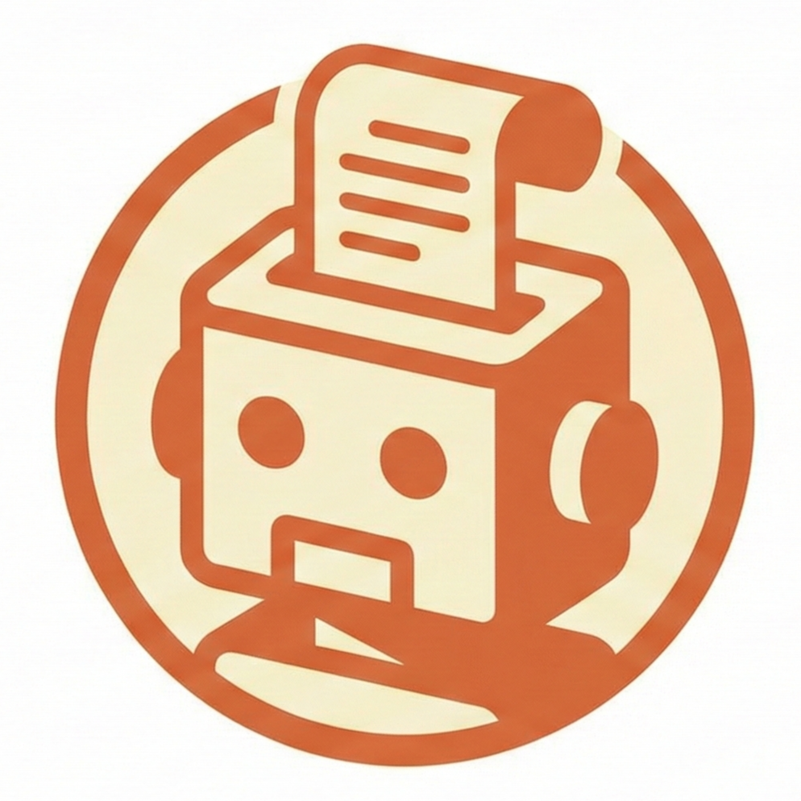
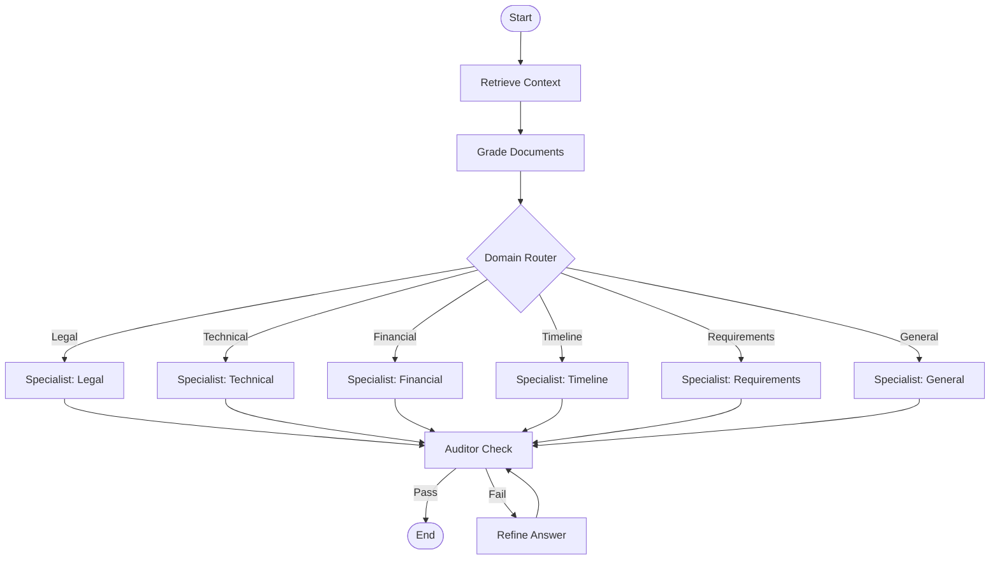

<div align="center">
  
  <h1>Multi-Agent RFP Orchestrator</h1>
  <p>
    <strong>Automated Tender Response System</strong><br>
    Intelligent document ingestion, information retrieval, and professional drafting using multi-agent architecture.
  </p>

  <p>
    <a href="#live-demo-architecture">Live Demo</a> •
    <a href="#key-features">Features</a> •
    <a href="#architecture">Architecture</a> •
    <a href="#deployment-guide">Deploy</a>
  </p>
</div>

---

## Live Demo Architecture

This project is deployed as a **production-ready Monorepo** with a decoupled frontend and backend:

| Layer | Technology | Hosting | URL |
|-------|------------|---------|-----|
| **Frontend** | React (Vite) + TypeScript | Vercel | [App URL] |
| **Backend** | FastAPI (Python) | Render | [API URL] |
| **Vector DB** | Qdrant (In-Memory) | Embedded | N/A |

### Performance Note

> **Important:** The backend runs on a **Free Tier** instance on Render. Please allow **up to 50 seconds** for the server to wake up on the first request. Subsequent requests will be fast.

### Privacy by Design

This system implements a **zero-persistence architecture** for maximum user privacy:

- **In-Memory Vector Store:** The Qdrant database runs entirely in RAM. No data is written to disk.
- **Ephemeral Sessions:** All uploaded documents and embeddings are automatically purged when the session ends or the server restarts.
- **No Tracking:** We do not store, log, or retain any user data.

This design ensures that your sensitive RFP documents are never persisted, making it ideal for evaluating confidential tenders.

---

## Overview

The **Multi-Agent RFP Orchestrator** is an advanced system designed to automate the process of responding to Requests for Proposals (RFPs). By leveraging a multi-agent architecture with specialized domain sub-agents, the system ingests tender documents (PDFs), retrieves relevant context using RAG (Retrieval-Augmented Generation), and synthesizes professional, compliant responses.

The core orchestration is handled by **LangGraph**, ensuring a robust state machine flow that includes quality auditing and iterative refinement of answers.

## Key Features

*   **Multi-Agent Architecture**: Clear separation of concerns with specialized agents for Legal, Financial, Technical, and Timeline domains.
*   **Intelligent Routing**: Automatically classifies inquiries to route them to the most appropriate domain specialist.
*   **RAG Pipeline**: Semantic search over ingested documents to ground answers in factual data.
*   **Quality Assurance**: Built-in auditor agent that validates responses against quality standards before delivery.
*   **Iterative Refinement**: Self-correction mechanism where the auditor can reject answers, triggering a refinement loop.
*   **Modern Stack**: Built with FastAPI, React, and leading AI orchestration tools.

## Architecture

The system operates on a state graph that coordinates the interaction between retrieval, reasoning, and generation.



## Technology Stack

| Component | Technology | Description |
|-----------|------------|-------------|
| **Orchestration** | LangGraph | State machine management for multi-agent workflows. |
| **LLM Inference** | Groq API | Fast inference using Llama 3 models. |
| **Embeddings** | HuggingFace Inference API | Cloud-based embeddings (saves RAM on free tier). |
| **Backend** | FastAPI | High-performance async Python framework. |
| **Frontend** | React + TypeScript | Modern, type-safe UI with TailwindCSS. |
| **Vector DB** | Qdrant (In-Memory) | Zero-maintenance vector storage for ephemeral deployments. |
| **Ingestion** | Docling | PDF extraction and document processing. |

## Project Structure

```text
/rfp-orchestrator
├── backend
│   ├── app
│   │   ├── agents      # LangGraph flows and sub-agents
│   │   ├── core        # Configuration and logging
│   │   ├── services    # RAG, LLM, and Embeddings services
│   │   └── main.py     # Application entry point
│   └── requirements.txt
├── frontend
│   ├── src
│   │   ├── components  # UI Components
│   │   ├── hooks       # Custom React hooks
│   └── package.json
└── README.md
```

---

## Deployment Guide

This Monorepo is designed for split deployment, with the frontend and backend hosted on different platforms.

### Backend (Render)

1.  **Create a new Web Service** on [Render](https://render.com/).
2.  **Connect your GitHub repository.**
3.  **Configure the service:**
    *   **Root Directory:** `backend`
    *   **Runtime:** `Docker`
    *   **Instance Type:** Free (or higher for production)
4.  **Set Environment Variables:**
    *   `GROQ_API_KEY`: Your Groq API key.
    *   `HUGGINGFACE_API_KEY`: Your HuggingFace API key (for embeddings).
    *   `ALLOWED_ORIGINS`: Your Vercel frontend URL (e.g., `https://your-app.vercel.app`).

### Frontend (Vercel)

1.  **Create a new Project** on [Vercel](https://vercel.com/).
2.  **Import your GitHub repository.**
3.  **Configure the project:**
    *   **Root Directory:** `frontend`
    *   **Framework Preset:** Vite
4.  **Set Environment Variables:**
    *   `VITE_API_URL`: Your Render backend URL (e.g., `https://your-api.onrender.com`).

---

## Strategic Value for Enterprise Leaders

The goal of this project is to demonstrate my ability to create these **Multi-Agent systems** at the corporate and enterprise levels. This system is not just software; it's a scalable and autonomous workforce designed to boost your team's productivity.

### Why Integrate Multi-Agent Systems?

*   **Operational Agility**: Reduce RFP response cycles from weeks to hours. Our agents work in parallel—parsing, retrieving, and drafting—allowing your human experts to focus purely on high-value strategy and review.
*   **Risk Mitigation**: The dedicated **Risk Sentinel** and **Legal Auditor** agents ensure every proposal adheres strictly to your corporate compliance and risk frameworks, eliminating costly oversight errors.
*   **Cost Efficiency**: Deploy a 24/7 digital workforce that scales instantly with demand, dramatically lowering the operational overhead of pre-sales and technical writing.
*   **Data-Driven Decisions**: Transform your historical repository of tenders into an active knowledge asset, ensuring consistency and leveraging past successes for future wins.