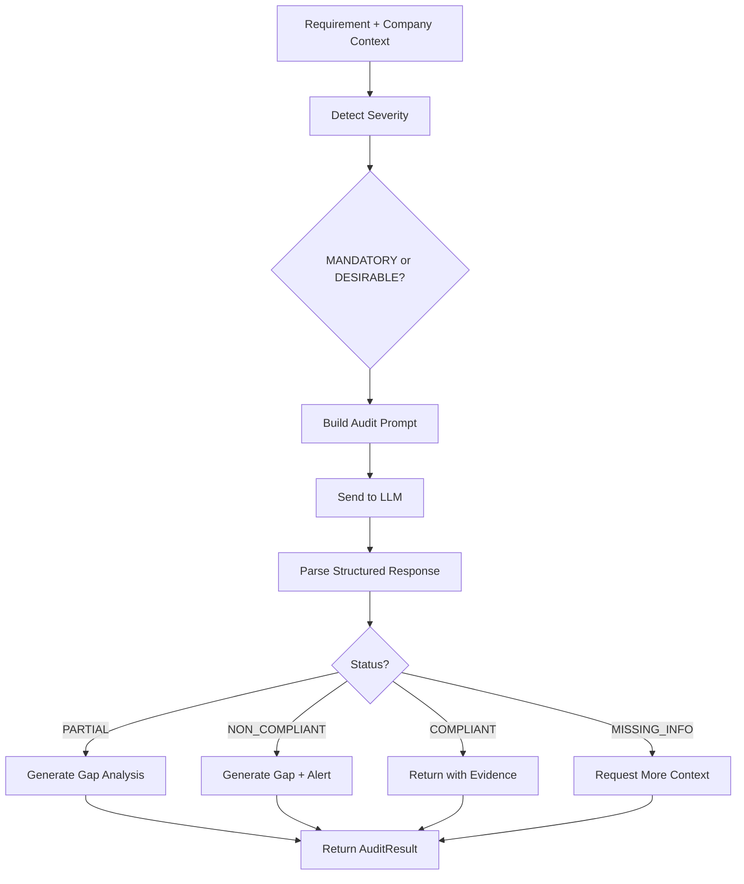

# Compliance Audit Validator Skill

## Propósito

Esta habilidad es el **cerebro legal** de TenderCortex. Compara "Lo que pide el pliego" vs "Lo que tiene la empresa" y emite un veredicto estructurado con evidencia.

**Filosofía de diseño: Pesimismo Constructivo**
> "Si no está explícito en el contexto de la empresa, asume que NO lo tienen."

Un solo `NON_COMPLIANT` en un requisito **Showstopper** (excluyente) descalifica toda la propuesta.

## Directrices de Uso Operativo

### Cuándo Usar
- Validar requisitos técnicos obligatorios (certificaciones, experiencia mínima)
- Detectar "Kill Criteria" que descalifican la propuesta
- Generar análisis de brechas (Gap Analysis) para requisitos parciales

### Cuándo NO Usar
- Requisitos subjetivos ("buena atención al cliente")
- Preguntas generales sobre el pliego
- Cálculos financieros (usar FinancialTableParser)

### Entrada

| Parámetro | Tipo | Requerido | Descripción |
|-----------|------|-----------|-------------|
| `requirement_text` | `str` | ✅ | Texto exacto del requisito del pliego |
| `requirement_source_page` | `int` | ✅ | Página donde aparece |
| `company_context` | `str` | ✅ | Fragmentos relevantes del perfil (CVs, ISOs, balances) |
| `requirement_category` | `str` | ❌ | Categoría opcional (legal, técnico, financiero) |

### Salida

`AuditResult` con:
- `status`: `COMPLIANT` | `NON_COMPLIANT` | `PARTIAL` | `MISSING_INFO`
- `confidence_score`: Nivel de certeza (0.0 - 1.0)
- `reasoning`: Explicación paso a paso del veredicto
- `gap_analysis`: Qué falta exactamente para cumplir (si aplica)
- `severity_detected`: `MANDATORY` (Showstopper) | `DESIRABLE` (Puntuable)
- `evidence_found`: Fragmento del contexto que respalda el veredicto

## Protocolo de Semáforo (Traffic Light)

| Status | Significado | Acción |
|--------|-------------|--------|
| 🟢 `COMPLIANT` | Cumple totalmente | Ninguna |
| 🟡 `PARTIAL` | Cumple parcialmente | Revisar gap_analysis |
| 🔴 `NON_COMPLIANT` | Incumplimiento claro | **CRÍTICO si es MANDATORY** |
| ⚪ `MISSING_INFO` | Sin información suficiente | Solicitar documentación |

## Detección de Severidad

El validador infiere la severidad del requisito basándose en el lenguaje:

| Palabras Clave | Severidad | Ejemplo |
|----------------|-----------|---------|
| "DEBE", "DEBERÁ", "OBLIGATORIO", "EXCLUYENTE" | `MANDATORY` | "El licitante DEBE contar con ISO 27001" |
| "SHALL", "MUST", "REQUIRED" | `MANDATORY` | "Contractor MUST have 5 years experience" |
| "SE VALORARÁ", "DESEABLE", "PREFERIBLE" | `DESIRABLE` | "Se valorará certificación CMMI" |
| "SHOULD", "MAY", "PLUS" | `DESIRABLE` | "ISO 14001 certification is a plus" |

## Ejemplos de Invocación (Few-Shot)

### Ejemplo 1: Detectar falta de certificación ISO
```
Usuario: "Valida si cumplimos el requisito de la página 32"

Requisito: "El licitante DEBERÁ contar con certificación ISO 27001 vigente"
Company Context: "Certificaciones: ISO 9001:2015 (vigente), ISO 14001:2015 (vigente)"

Resultado:
{
    "status": "NON_COMPLIANT",
    "confidence_score": 0.95,
    "severity_detected": "MANDATORY",
    "reasoning": "El pliego exige ISO 27001 de forma obligatoria (verbo 'DEBERÁ'). 
                  El perfil de la empresa muestra ISO 9001 e ISO 14001, 
                  pero NO menciona ISO 27001.",
    "gap_analysis": "Falta: Certificación ISO 27001 vigente. 
                     Se requiere obtener la certificación antes de presentar la propuesta.",
    "evidence_found": "Certificaciones: ISO 9001:2015 (vigente), ISO 14001:2015 (vigente)"
}
```

### Ejemplo 2: Cumplimiento parcial de experiencia
```
Requisito: "El licitante debe acreditar mínimo 5 años de experiencia en proyectos similares"
Company Context: "Fundada en 2021. Proyectos ejecutados: Implementación ERP (2022), 
                  Migración Cloud (2023), Sistema CRM (2024)."

Resultado:
{
    "status": "NON_COMPLIANT",
    "confidence_score": 0.90,
    "severity_detected": "MANDATORY",
    "reasoning": "La empresa fue fundada en 2021, lo que implica máximo 3-4 años 
                  de trayectoria. El requisito exige mínimo 5 años.",
    "gap_analysis": "Brecha: 1-2 años de experiencia faltante. 
                     Se podría explorar alianza con empresa de mayor trayectoria."
}
```

### Ejemplo 3: Requisito deseable cumplido
```
Requisito: "Se valorará que el equipo cuente con certificación PMP"
Company Context: "Equipo: Juan Pérez (PMP, 10 años exp), María García (ITIL, 8 años)"

Resultado:
{
    "status": "COMPLIANT",
    "confidence_score": 0.85,
    "severity_detected": "DESIRABLE",
    "reasoning": "El requisito es puntuable ('se valorará'). 
                  El contexto muestra que Juan Pérez tiene certificación PMP.",
    "evidence_found": "Juan Pérez (PMP, 10 años exp)"
}
```

## Guardrails y Limitaciones

> [!CAUTION]
> **Costos de Token**: Esta skill consume tokens LLM por cada requisito. Un pliego con 500 requisitos puede ser costoso. Use selectivamente en requisitos clave.

> [!WARNING]
> **Falsos Negativos**: A veces la empresa cumple pero el texto del contexto no era claro. El sistema preferirá `MISSING_INFO` a un falso positivo.

> [!NOTE]
> **Contexto Insuficiente**: Si el `company_context` es vacío o irrelevante, el resultado será `MISSING_INFO` con alta confianza.

## Diagrama de Flujo



## Prompt Interno (Auditor Escéptico)

El sistema construye dinámicamente un prompt que fuerza al LLM a ser riguroso:

```
Eres un AUDITOR DE LICITACIONES extremadamente estricto. Tu trabajo es 
determinar si una empresa CUMPLE o NO CUMPLE un requisito específico.

REGLAS INAMOVIBLES:
1. Si la información NO está EXPLÍCITAMENTE en el contexto de la empresa, 
   asume que NO lo tienen.
2. Sé pesimista: es mejor un falso negativo que un falso positivo.
3. Los verbos "DEBE", "DEBERÁ", "SHALL", "MUST" indican requisitos OBLIGATORIOS.
4. Los verbos "se valorará", "deseable", "preferible" indican requisitos OPCIONALES.
5. Cita EXACTAMENTE el fragmento del contexto que respalda tu veredicto.
```
