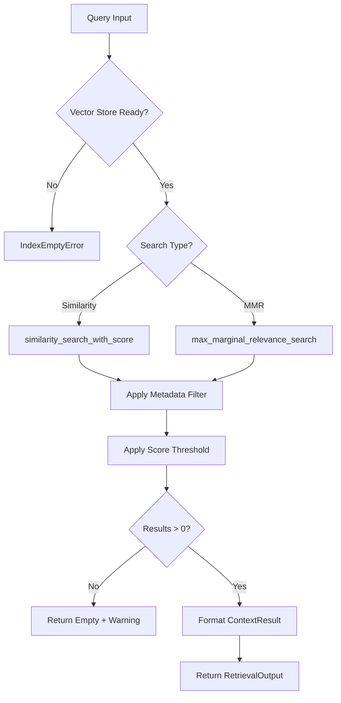

# Context Retriever Skill

## Propósito

Esta habilidad permite a los agentes especializados (Legal, Técnico, Financiero) recuperar contexto relevante de los documentos RFP indexados. Implementa estrategias avanzadas de recuperación para maximizar la calidad del contexto:

1. **MMR (Maximal Marginal Relevance)**: Penaliza la redundancia para obtener chunks diversos
2. **Filtrado por Metadatos**: Permite a cada agente buscar solo en su dominio
3. **Score Thresholding**: Descarta resultados de baja confianza para evitar alucinaciones
4. **Citas Precisas**: Cada resultado incluye page_number, source_file y chunk_id

## Directrices de Uso Operativo

### Cuándo Usar
- Responder preguntas sobre contenido de documentos RFP
- Buscar cláusulas o términos específicos
- Recuperar contexto para análisis especializado (legal, técnico, financiero)

### Cuándo NO Usar
- Ingestar nuevos documentos (usar RFPDocumentLoader)
- Consultas generales que no requieren contexto del RFP
- Cuando el Vector Store no tiene documentos indexados

### Entrada

| Parámetro | Tipo | Requerido | Descripción |
|-----------|------|-----------|-------------|
| `query` | `str` | ✅ | La pregunta o concepto a buscar |
| `top_k` | `int` | ❌ | Número de chunks a recuperar (default: 4) |
| `search_type` | `SearchType` | ❌ | `SIMILARITY` o `MMR` (default: MMR) |
| `metadata_filter` | `dict` | ❌ | Filtros clave-valor para limitar búsqueda |
| `score_threshold` | `float` | ❌ | Umbral mínimo de similitud (default: 0.65) |

### Salida

`RetrievalOutput` con:
- `results`: Lista de `ContextResult` con content, metadata, relevance_score
- `query`: La query original normalizada
- `total_found`: Cantidad de resultados antes del threshold
- `warning`: Mensaje si hay pocos resultados o baja confianza

## Filtrado por Metadatos

Los agentes pueden filtrar resultados usando metadata_filter:

```python
# Solo buscar en páginas del anexo técnico
metadata_filter = {
    "source": "anexo_tecnico.pdf",
}

# Solo buscar después de página 10
metadata_filter = {
    "page": {"$gt": 10}
}

# Combinar filtros
metadata_filter = {
    "source": "pliego_bases.pdf",
    "page": {"$gte": 5, "$lte": 20}
}
```

## Ejemplos de Invocación (Few-Shot)

### Ejemplo 1: Búsqueda estándar con MMR
```
Usuario: "¿Cuáles son las multas por incumplimiento?"

Acción:
retriever.retrieve(
    query="multas por incumplimiento contrato penalidades",
    top_k=4,
    search_type=SearchType.MMR
)
```

### Ejemplo 2: Búsqueda filtrada por agente legal
```
Usuario: "Busca la cláusula de garantía en los documentos legales"

Razonamiento: Usuario menciona "legales", filtrar por source que contenga "legal" o "contrato"

Acción:
retriever.retrieve(
    query="cláusula garantía cumplimiento",
    metadata_filter={"source": {"$contains": "legal"}},
    search_type=SearchType.MMR
)
```

### Ejemplo 3: Búsqueda de alta precisión
```
Usuario: "Necesito información muy precisa sobre ISO 27001"

Razonamiento: Usuario pide alta precisión, aumentar threshold.

Acción:
retriever.retrieve(
    query="ISO 27001 certificación seguridad información",
    score_threshold=0.75,
    top_k=3
)
```

## Manejo de Errores

| Error | Respuesta del Sistema |
|-------|----------------------|
| Vector Store vacío | `IndexEmptyError` con instrucciones para ingestar documentos |
| Sin resultados sobre threshold | Retorna lista vacía con `warning` explicativo |
| Timeout de búsqueda | `SearchTimeoutError` con query que falló |

## Diagrama de Flujo


