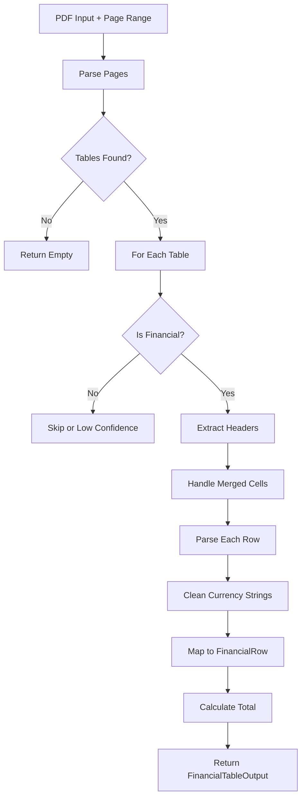

# Financial Table Parser Skill

## Propósito

Esta habilidad proporciona extracción **determinista** de tablas financieras desde PDFs de licitación. Los LLMs son propensos a errores matemáticos con texto; esta herramienta garantiza datos numéricos precisos listos para cálculos.

**Características principales:**

1. **Extracción con pdfplumber**: Detecta grillas de tablas respetando celdas fusionadas
2. **Filtro de tablas financieras**: Solo procesa tablas con keywords monetarios
3. **Sanitización de monedas**: Convierte `"$ 1.500,00"` → `1500.0`
4. **Output estructurado**: JSON-like con headers normalizados (snake_case)

## Directrices de Uso Operativo

### Cuándo Usar
- Extraer precios unitarios, cantidades y totales de tablas de cotización
- Calcular sumas o validar totales de presupuestos
- Obtener datos numéricos para análisis financiero

### Cuándo NO Usar
- Tablas de índice o contenido (no tienen datos financieros)
- PDFs escaneados sin capa de texto (requieren OCR previo)
- Texto corrido sin estructura tabular

### Entrada

| Parámetro | Tipo | Requerido | Descripción |
|-----------|------|-----------|-------------|
| `file_path` | `str` | ✅ | Ruta absoluta al archivo PDF |
| `page_range` | `str` | ✅ | Páginas a analizar: `"5-10"`, `"15"`, `"1,3,5-7"` |
| `currency_hint` | `str` | ❌ | Moneda por defecto: `"USD"`, `"ARS"`, `"EUR"` (default: USD) |
| `confidence_threshold` | `float` | ❌ | Umbral mínimo de confianza financiera (default: 0.5) |

### Salida

`FinancialTableOutput` por cada tabla detectada:
- `table_id`: Identificador secuencial
- `page_number`: Página donde se encontró
- `headers`: Lista de encabezados normalizados
- `rows`: Lista de `FinancialRow` con datos parseados
- `total_detected`: Suma calculada de la columna de totales
- `confidence`: Score de confianza financiera (0-1)

## Sanitización de Monedas

La función `_clean_currency_string()` maneja múltiples formatos:

| Entrada | Salida |
|---------|--------|
| `"$ 1.500,00"` | `1500.0` |
| `"1,500.00 USD"` | `1500.0` |
| `"(500)"` | `-500.0` |
| `"€ 2.345,67"` | `2345.67` |
| `"1'234'567.89"` | `1234567.89` |
| `"-$1,234.56"` | `-1234.56` |
| `"N/A"`, `"-"`, `""` | `None` |

## Detección de Tablas Financieras

Una tabla se considera "financiera" si contiene keywords en headers o celdas:

```python
FINANCIAL_KEYWORDS = [
    "precio", "price", "monto", "amount", "total", 
    "cost", "costo", "unit", "unidad", "subtotal",
    "iva", "tax", "importe", "valor", "value",
    "$", "€", "usd", "ars", "eur"
]
```

Tablas sin estos keywords reciben `confidence < 0.5` y pueden ser filtradas.

## Ejemplos de Invocación (Few-Shot)

### Ejemplo 1: Extraer tablas de páginas específicas
```
Usuario: "Extrae los precios de las páginas 45 a 47 del pliego"

Acción:
parser = FinancialTableParser()
tables = parser.extract(
    file_path="/docs/pliego_precios.pdf",
    page_range="45-47"
)

for table in tables:
    print(f"Tabla {table.table_id} (pág. {table.page_number})")
    print(f"Total calculado: ${table.total_detected:,.2f}")
```

### Ejemplo 2: Validar totales de presupuesto
```
Usuario: "Necesito verificar que los totales del Anexo B sumen correctamente"

Razonamiento: Usuario quiere validación de sumas, extraer y calcular.

Acción:
tables = parser.extract(
    file_path="/docs/anexo_b.pdf",
    page_range="1-5",
    currency_hint="ARS"
)

for table in tables:
    calculated = sum(row.total_price or 0 for row in table.rows)
    print(f"Suma calculada: {calculated}")
    print(f"Total en tabla: {table.total_detected}")
    print(f"Diferencia: {abs(calculated - table.total_detected)}")
```

### Ejemplo 3: Solo tablas de alta confianza
```
Usuario: "Solo dame las tablas que seguro son de precios"

Acción:
tables = parser.extract(
    file_path="/docs/licitacion.pdf",
    page_range="1-50",
    confidence_threshold=0.8  # Solo alta confianza
)
```

## Manejo de Celdas Fusionadas

El parser detecta y propaga valores de celdas fusionadas verticalmente:

```
| Categoría   | Producto  | Precio |
|-------------|-----------|--------|
| Servidores  | Dell R740 | $5,000 |  ← "Servidores" se propaga
|             | HP DL380  | $4,500 |
|             | Lenovo SR | $4,200 |
| Storage     | NetApp    | $8,000 |  ← Nueva categoría
```

## Guardrails y Limitaciones

> [!CAUTION]
> **PDFs escaneados**: Si el PDF es una imagen escaneada, `pdfplumber` no puede detectar tablas. Use `RFPDocumentLoader` con OCR primero.

> [!WARNING]
> **Ambigüedad de separadores**: El parser intenta detectar automáticamente si `,` es separador de miles o decimales, pero puede fallar en casos ambiguos como `"1,234"` (¿1234 o 1.234?).

> [!NOTE]
> **Tablas complejas**: Tablas con múltiples niveles de headers o estructuras irregulares pueden no parsearse correctamente.

## Diagrama de Flujo


