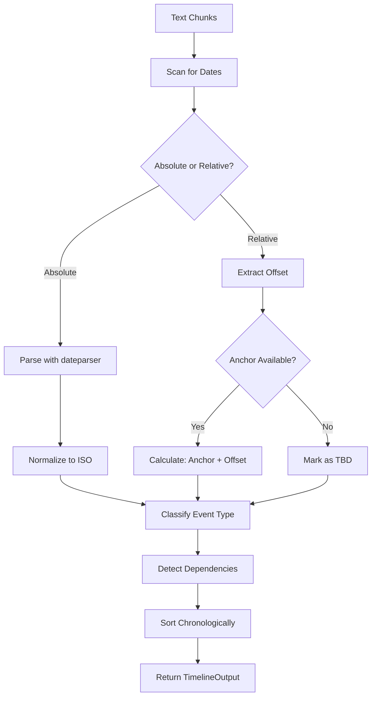

# Gantt Timeline Extractor Skill

## Propósito

Esta habilidad es el **motor cronológico** de TenderCortex. Extrae todas las expresiones temporales de un pliego, las normaliza a formato ISO 8601 (`YYYY-MM-DD`), y construye una secuencia lógica de hitos.

**Tipos de expresiones que procesa:**

| Tipo | Ejemplo | Output |
|------|---------|--------|
| Fecha absoluta | "15 de Octubre 2024" | `2024-10-15` |
| Fecha relativa | "30 días post-firma" | `anchor + 30 días` |
| Duración | "El proyecto durará 6 meses" | `duration: 6 months` |
| Implícita | "2 semanas antes de la entrega" | Depende de evento |

## Directrices de Uso Operativo

### Cuándo Usar
- Construir cronograma del proyecto desde el pliego
- Identificar deadlines críticos (entrega de oferta, Q&A)
- Calcular duración total del contrato
- Detectar dependencias entre hitos

### Cuándo NO Usar
- Cálculos financieros (usar FinancialTableParser)
- Validación de requisitos (usar ComplianceAuditValidator)

### Entrada

| Parámetro | Tipo | Requerido | Descripción |
|-----------|------|-----------|-------------|
| `text_chunks` | `List[DocumentChunk]` | ✅ | Chunks del documento con metadata |
| `anchor_date` | `str` | ✅ | Fecha base para cálculos: `YYYY-MM-DD` |
| `language_hint` | `str` | ❌ | Idioma: `es`, `en` (default: auto) |

### Salida

`TimelineOutput`:
- `events`: Lista de `TimelineEvent` ordenados cronológicamente
- `anchor_date_used`: Fecha base utilizada
- `project_duration_months`: Duración estimada del proyecto
- `critical_deadlines`: Lista de eventos con deadline crítico
- `warnings`: Advertencias (fechas ambiguas, TBD, etc.)

## Taxonomía de Eventos

| EventType | Descripción | Keywords |
|-----------|-------------|----------|
| `SUBMISSION_DEADLINE` | Fecha límite de entrega de oferta | "entrega", "límite", "deadline", "vencimiento" |
| `QA_DEADLINE` | Límite para preguntas/aclaraciones | "consultas", "preguntas", "Q&A", "aclaraciones" |
| `PROJECT_START` | Inicio del proyecto/contrato | "inicio", "comienza", "firma", "adjudicación" |
| `MILESTONE` | Hito intermedio del proyecto | "fase", "etapa", "entregable", "hito" |
| `CONTRACT_END` | Fin de vigencia del contrato | "fin", "término", "vencimiento", "vigencia" |
| `MEETING` | Reunión o visita técnica | "reunión", "visita", "junta", "meeting" |
| `OTHER` | Otros eventos temporales | - |

## Resolución de Fechas Relativas

El extractor maneja expresiones relativas usando la `anchor_date`:

```
"30 días después de la firma" 
  → anchor_date = 2024-01-15 (firma)
  → date_iso = 2024-02-14

"2 semanas antes de la entrega"
  → Busca evento "entrega" primero
  → Calcula offset desde ese evento
```

### Reglas de Ambigüedad

| Caso | Regla |
|------|-------|
| Sin año ("15 de Marzo") | Asumir año del `anchor_date` o siguiente si ya pasó |
| Solo mes ("Marzo") | Usar día 1 del mes |
| Rango ("Marzo a Junio") | Crear 2 eventos: START y END |
| TBD ("a definir") | `date_iso = null`, capturar condición |

## Ejemplos de Invocación (Few-Shot)

### Ejemplo 1: Extraer cronograma básico
```python
chunks = [
    DocumentChunk(
        content="La oferta debe entregarse el 15/05/2024. "
                "El proyecto iniciará 30 días después de la adjudicación. "
                "La duración del contrato será de 12 meses.",
        page_number=5,
        source_file="pliego.pdf"
    )
]

extractor = GanttTimelineExtractor()
result = extractor.extract(
    text_chunks=chunks,
    anchor_date="2024-04-01"
)

# Output:
{
    "events": [
        {
            "date_iso": "2024-05-15",
            "original_text": "15/05/2024",
            "description": "Fecha límite de entrega de oferta",
            "event_type": "SUBMISSION_DEADLINE",
            "is_relative": false,
            "source_page": 5
        },
        {
            "date_iso": null,
            "original_text": "30 días después de la adjudicación",
            "description": "Inicio del proyecto",
            "event_type": "PROJECT_START",
            "is_relative": true,
            "dependency": "adjudicación",
            "offset_days": 30,
            "source_page": 5
        }
    ],
    "project_duration_months": 12,
    "anchor_date_used": "2024-04-01"
}
```

### Ejemplo 2: Múltiples hitos
```
Texto: "CRONOGRAMA:
- Fase 1: Análisis (Semanas 1-4)
- Fase 2: Desarrollo (Semanas 5-16)
- Fase 3: Testing (Semanas 17-20)
- Entrega final: 20 de Diciembre 2024"

Output: 4 eventos MILESTONE + 1 SUBMISSION_DEADLINE
```

### Ejemplo 3: Fecha ambigua
```
Texto: "La reunión informativa será el 15 de Marzo a las 10:00"
Anchor: 2024-04-01

Razonamiento: Marzo ya pasó en 2024, asumir 2025
Output: date_iso = "2025-03-15"
Warning: "Año inferido para '15 de Marzo' - verificar"
```

## Dependencias entre Eventos

El extractor detecta dependencias simples:

```python
# Input
"La entrega preliminar será 2 semanas antes de la entrega final"

# Output
TimelineEvent(
    date_iso=null,
    original_text="2 semanas antes de la entrega final",
    event_type="MILESTONE",
    dependency="entrega final",
    offset_days=-14,
    is_relative=true
)
```

## Guardrails y Limitaciones

> [!CAUTION]
> **Ambigüedad de año**: Si el texto dice "15 de Marzo" sin año, el extractor asume el año del `anchor_date` o el siguiente si la fecha ya pasó. Siempre verificar manualmente.

> [!WARNING]
> **Dependencias circulares**: Si A depende de B y B depende de A, el extractor emitirá warning y marcará ambas como TBD.

> [!NOTE]
> **Idioma mixto**: El extractor soporta español e inglés en el mismo documento gracias a `dateparser`.

## Diagrama de Flujo


