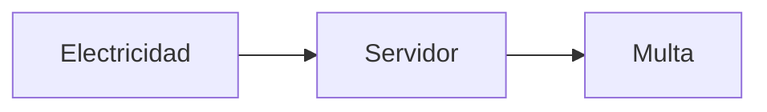
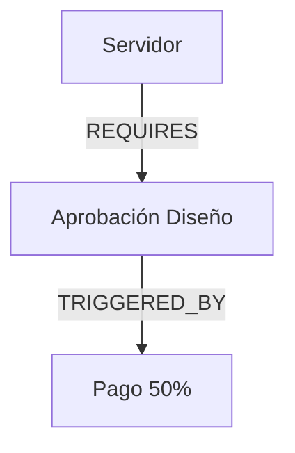
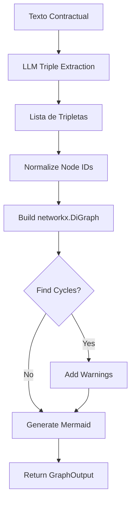

# Knowledge Graph Builder Skill

## Propósito

Esta habilidad es el **motor de razonamiento relacional** de TenderCortex. Mientras que el ContextRetriever encuentra *dónde* está la información, el KnowledgeGraphBuilder entiende *cómo se conecta*.

**El problema del RAG clásico:**

```
Texto: "La multa (A) se aplica si falla el servidor (B), 
       el cual depende de la electricidad (C)"

RAG Vector: Encuentra "multa" ✓
RAG Vector: No sabe que electricidad es la causa raíz ✗
```

**Solución: Grafo de Dependencias**



## Directrices de Uso Operativo

### Cuándo Usar
- Analizar dependencias entre hitos de pago
- Detectar deadlocks contractuales (A requiere B, B requiere A)
- Mapear stakeholders y sus obligaciones
- Visualizar flujo de riesgos

### Cuándo NO Usar
- Búsqueda de información puntual (usar ContextRetriever)
- Análisis financiero (usar FinancialTableParser)
- **Documentos completos** (explosión de nodos - procesar por secciones)

### Entrada

| Parámetro | Tipo | Requerido | Descripción |
|-----------|------|-----------|-------------|
| `text` | `str` | ✅ | Texto de la sección a analizar |
| `section_label` | `str` | ❌ | Etiqueta de la sección ("Cláusula 5") |
| `existing_graph` | `GraphOutput` | ❌ | Grafo previo para incrementar |

### Salida

`GraphOutput`:
- `nodes`: Lista de `GraphNode` con tipo y propiedades
- `edges`: Lista de `GraphEdge` con relación y peso
- `mermaid_code`: Código para visualización inmediata
- `cycles_detected`: Lista de ciclos (deadlocks)
- `warnings`: Advertencias sobre estructura

## Ontología Restringida

El grafo usa una **taxonomía estricta** para evitar convertirse en una "bola de pelo":

### Tipos de Nodos

| NodeType | Descripción | Ejemplo |
|----------|-------------|---------|
| `REQUIREMENT` | Requisito del pliego | "ISO 27001 obligatoria" |
| `STAKEHOLDER` | Actor/Entidad | "Contratista", "Cliente" |
| `MILESTONE` | Hito de proyecto/pago | "Entrega Fase 1", "Pago 50%" |
| `RESOURCE` | Recurso necesario | "Servidor", "Licencia Oracle" |
| `RISK` | Riesgo identificado | "Multa por retraso" |

### Tipos de Relaciones

| EdgeType | Descripción | Semántica |
|----------|-------------|-----------|
| `DEPENDS_ON` | Dependencia fuerte | A no puede existir sin B |
| `BLOCKS` | Bloqueo exclusivo | Si A ocurre, B no puede |
| `REQUIRES` | Necesidad de recurso | A necesita B para funcionar |
| `RELATED_TO` | Relación semántica | A menciona o refiere a B |
| `TRIGGERED_BY` | Causa-efecto | A sucede porque B sucedió |

## Extracción de Tripletas (LLM Chain)

El builder usa un LLM para convertir texto en tripletas estructuradas:

### Prompt de Extracción

```
Analiza el siguiente texto contractual y extrae TODAS las relaciones
entre entidades en formato de tripletas.

Formato de salida (JSON):
[
  {
    "subject": {"id": "pago_50", "label": "Pago 50%", "type": "milestone"},
    "predicate": "triggered_by",
    "object": {"id": "aprobacion_diseno", "label": "Aprobación Diseño", "type": "milestone"}
  }
]

TEXTO:
{text}
```

### Ejemplo de Extracción

**Input:**
```
"El pago del 50% se libera tras la aprobación del diseño. 
 La aprobación del diseño requiere que el servidor esté operativo.
 Si el servidor falla, se aplicará una multa del 2%."
```

**Output (Tripletas):**
```json
[
  {"subject": "Pago 50%", "predicate": "TRIGGERED_BY", "object": "Aprobación Diseño"},
  {"subject": "Aprobación Diseño", "predicate": "REQUIRES", "object": "Servidor"},
  {"subject": "Multa 2%", "predicate": "TRIGGERED_BY", "object": "Falla Servidor"},
  {"subject": "Servidor", "predicate": "BLOCKS", "object": "Aprobación Diseño"}
]
```

## Detección de Ciclos (Deadlocks)

Una función crítica es detectar **dependencias circulares**:

```python
builder = KnowledgeGraphBuilder()
graph = builder.build_from_text(text)

cycles = builder.find_cycles()
# Output: [["Hito_A", "Hito_B", "Hito_A"]]
# Warning: "Deadlock detectado: Hito_A → Hito_B → Hito_A"
```

### Ejemplo Real de Deadlock

```
Cláusula 5: "El Hito 2 se paga tras completar el Hito 1"
Cláusula 8: "El Hito 1 requiere aprobación del Hito 2"

→ Deadlock: Imposible completar ningún hito
```

## Exportación y Visualización

### Mermaid (Frontend)

```python
mermaid_code = builder.to_mermaid()
```

Output:


### GraphML (Gephi)

```python
builder.export_graphml("contrato_graph.graphml")
```

## Ejemplos de Invocación (Few-Shot)

### Ejemplo 1: Construcción básica

```python
text = """
CLÁUSULA 5 - PAGOS:
El pago del 30% se realizará tras la entrega del Informe de Diseño.
El pago del 70% restante se liberará tras la aprobación del Entregable Final.
La aprobación del Entregable Final requiere la validación del Cliente.
"""

builder = KnowledgeGraphBuilder()
result = builder.build_from_text(text, section_label="Cláusula 5")

print(f"Nodos: {len(result.nodes)}")  # 5
print(f"Aristas: {len(result.edges)}")  # 4
print(f"Ciclos: {result.cycles_detected}")  # []
print(result.mermaid_code)
```

### Ejemplo 2: Detección de deadlock

```python
text = """
El Hito A se completa cuando se aprueba el Hito B.
El Hito B no puede iniciarse hasta que se complete el Hito A.
"""

result = builder.build_from_text(text)
print(f"⚠️ Ciclos: {result.cycles_detected}")
# Output: [["hito_a", "hito_b", "hito_a"]]
```

### Ejemplo 3: Grafo incremental

```python
# Construir por secciones para evitar explosión
graph1 = builder.build_from_text(clausula_pagos, section_label="Pagos")
graph2 = builder.build_from_text(clausula_riesgos, section_label="Riesgos", 
                                  existing_graph=graph1)

# El grafo final tiene nodos de ambas secciones
print(f"Total nodos: {len(graph2.nodes)}")
```

## Guardrails y Limitaciones

> [!CAUTION]
> **Explosión de Nodos**: Si se pasa el documento entero (50+ páginas), el grafo será ilegible y el LLM alucinará relaciones. **Procesar por secciones** (ej. "Solo Cláusula de Pagos").

> [!WARNING]
> **Calidad del LLM**: La extracción de tripletas depende de la capacidad del LLM. Usar modelos con buen razonamiento (GPT-4, Claude) para textos legales complejos.

> [!NOTE]
> **Nodos duplicados**: El builder normaliza IDs (lowercase, snake_case) para evitar duplicados como "Pago 50%" y "pago del 50%".

## Diagrama de Arquitectura


