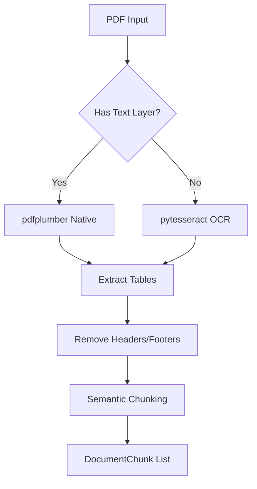

# RFP Document Loader Skill

## Propósito

Esta habilidad es la **puerta de entrada** del sistema TenderCortex. Transforma documentos PDF de licitaciones en chunks estructurados listos para indexación vectorial. Implementa un motor de ingesta híbrido que:

1. **Detecta automáticamente** si el PDF tiene texto seleccionable o es un escaneo
2. **Extrae tablas** preservándolas como Markdown (no texto plano ininteligible)
3. **Elimina ruido** de headers/footers repetitivos
4. **Genera chunks semánticos** con metadatos ricos para RAG

## Directrices de Uso Operativo

### Cuándo Usar
- Ingesta de nuevos documentos RFP al sistema
- Re-procesamiento de documentos con estrategia diferente
- Validación de calidad de extracción antes de indexar

### Cuándo NO Usar
- Análisis semántico del contenido (usar agentes especializados)
- Búsqueda en documentos ya indexados (usar RAG Service)
- Procesamiento de archivos que no sean PDF

### Entrada

| Parámetro | Tipo | Requerido | Descripción |
|-----------|------|-----------|-------------|
| `file_path` | `str` | ✅ | Ruta absoluta al archivo PDF local |
| `strategy` | `ProcessingStrategy` | ❌ | `FAST`, `OCR_ONLY`, o `HI_RES` (default) |
| `extract_tables` | `bool` | ❌ | Parsear tablas a Markdown (default: `True`) |

### Salida

Lista de `DocumentChunk` con:
- `content`: Texto limpio extraído
- `page_number`: Página de origen (1-indexed)
- `chunk_type`: `text`, `table`, o `image_caption`
- `metadata`: Diccionario con datos adicionales (source, OCR confidence, etc.)

## Limitaciones Técnicas

> [!CAUTION]
> - **PDFs protegidos**: Lanza `EncryptedPDFError` para archivos con contraseña
> - **Límite de páginas**: Timeout automático para documentos >500 páginas
> - **OCR**: Requiere Tesseract instalado en el sistema para PDFs escaneados
> - **Idiomas**: OCR optimizado para español e inglés

## Ejemplos de Invocación (Few-Shot)

### Ejemplo 1: Ingesta estándar
```
Usuario: "Carga el documento de licitación ubicado en /docs/rfp_2024.pdf"

Razonamiento: Solicitud de ingesta de PDF local con ruta explícita.

Acción: 
loader = RFPLoader()
chunks = loader.load(
    file_path="/docs/rfp_2024.pdf",
    strategy=ProcessingStrategy.HI_RES,
    extract_tables=True
)
```

### Ejemplo 2: Procesamiento rápido
```
Usuario: "Necesito una vista previa rápida del documento licitacion.pdf"

Razonamiento: El usuario pide rapidez, usar estrategia FAST que omite OCR y análisis profundo.

Acción:
chunks = loader.load(
    file_path="/path/to/licitacion.pdf",
    strategy=ProcessingStrategy.FAST
)
```

### Ejemplo 3: Documento escaneado
```
Usuario: "El PDF es un escaneo, necesito extraer el texto con OCR"

Razonamiento: Usuario indica explícitamente que es un escaneo, forzar OCR.

Acción:
chunks = loader.load(
    file_path="/path/to/scanned.pdf",
    strategy=ProcessingStrategy.OCR_ONLY
)
```

## Flujo de Procesamiento


