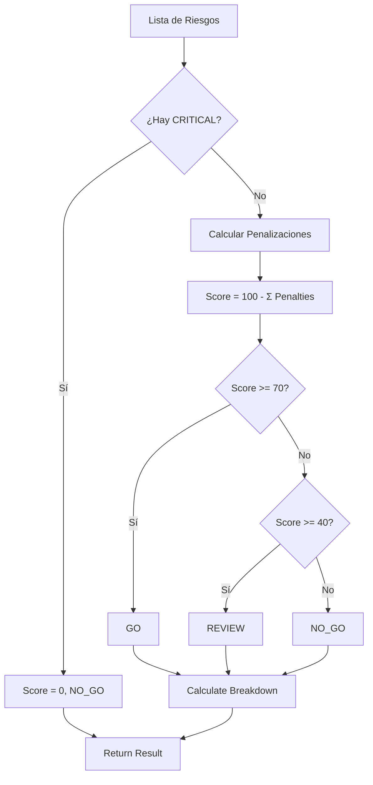

# Risk Score Calculator Skill

## Propósito

Esta habilidad es la **calculadora de viabilidad de licitaciones** de TenderCortex. Consolida todos los riesgos detectados por los agentes (Legal, Financiero, Técnico) y genera un **Score único** con recomendación ejecutiva.

**Filosofía: Un número > 50 problemas dispersos**

El usuario humano no puede procesar 50 hallazgos individuales. Necesita:
1. Un número: **Score 67/100**
2. Una acción: **GO / NO-GO / REVIEW**

## Algoritmo de Scoring

### Fórmula Base
```
Score = 100 - Σ(SeverityWeight × Probability)
```

### Pesos por Severidad

| Severidad | Peso | Descripción |
|-----------|------|-------------|
| `LOW` | 2 pts | Riesgo menor, impacto limitado |
| `MEDIUM` | 5 pts | Riesgo moderado, requiere atención |
| `HIGH` | 15 pts | Riesgo significativo, impacto considerable |
| `CRITICAL` | ∞ (Veto) | **Kill Switch** - Score = 0 automático |

### Kill Switch (Veto Automático)

Si **cualquier** riesgo tiene severidad `CRITICAL`, el sistema activa el Kill Switch:
- Score se colapsa a **0**
- Recommendation se fuerza a **NO_GO**
- Se ignora el resto del cálculo

Ejemplos de riesgos CRITICAL:
- Presupuesto 50% debajo del costo mínimo
- Sanción legal activa contra la empresa
- Requisito excluyente no cumplido (Kill Criteria)

### Umbrales de Recomendación

| Score | Recomendación | Significado |
|-------|---------------|-------------|
| ≥ 70 | 🟢 **GO** | Propuesta viable, proceder |
| 40 - 69 | 🟡 **REVIEW** | Revisar riesgos antes de decidir |
| < 40 | 🔴 **NO_GO** | No presentar propuesta |

## Directrices de Uso Operativo

### Entrada

| Parámetro | Tipo | Requerido | Descripción |
|-----------|------|-----------|-------------|
| `risks` | `List[RiskFactorInput]` | ✅ | Lista de riesgos detectados por agentes |

Cada `RiskFactorInput` contiene:
- `description`: Descripción breve del riesgo
- `category`: FINANCIAL, LEGAL, TECHNICAL, REPUTATIONAL
- `severity`: LOW, MEDIUM, HIGH, CRITICAL
- `probability`: 0.0 a 1.0 (probabilidad de ocurrencia)
- `source_agent`: Agente que reportó el riesgo

### Salida

`RiskAssessmentOutput`:
- `total_score`: Puntuación 0-100
- `recommendation`: GO / NO_GO / REVIEW
- `critical_flags`: Riesgos que activaron Kill Switch
- `breakdown_by_category`: Score desglosado por área
- `risk_matrix`: Matriz 3x3 de clasificación

## Ejemplos de Invocación (Few-Shot)

### Ejemplo 1: Propuesta viable con riesgos menores
```python
risks = [
    RiskFactorInput(
        description="Plazo de entrega ajustado",
        category=RiskCategory.TECHNICAL,
        severity=Severity.LOW,
        probability=0.6,
        source_agent="TechnicalAgent"
    ),
    RiskFactorInput(
        description="Falta experiencia en sector salud",
        category=RiskCategory.TECHNICAL,
        severity=Severity.MEDIUM,
        probability=0.4,
        source_agent="RequirementsAgent"
    ),
]

result = calculator.calculate(risks)
# total_score: 96.8 (100 - 2*0.6 - 5*0.4)
# recommendation: "GO"
```

### Ejemplo 2: Kill Switch activado
```python
risks = [
    RiskFactorInput(
        description="Buen equipo técnico",
        category=RiskCategory.TECHNICAL,
        severity=Severity.LOW,
        probability=0.2,
        source_agent="TechnicalAgent"
    ),
    RiskFactorInput(
        description="SANCIÓN ACTIVA DEL OSCE",  # ⚠️ CRITICAL
        category=RiskCategory.LEGAL,
        severity=Severity.CRITICAL,
        probability=1.0,
        source_agent="LegalAgent"
    ),
]

result = calculator.calculate(risks)
# total_score: 0
# recommendation: "NO_GO"
# critical_flags: ["SANCIÓN ACTIVA DEL OSCE"]
```

### Ejemplo 3: Requiere revisión
```python
risks = [
    RiskFactorInput(
        description="Margen de utilidad bajo (8%)",
        category=RiskCategory.FINANCIAL,
        severity=Severity.HIGH,
        probability=0.9,
        source_agent="FinancialAgent"
    ),
    RiskFactorInput(
        description="Cláusula de penalidad agresiva",
        category=RiskCategory.LEGAL,
        severity=Severity.MEDIUM,
        probability=0.7,
        source_agent="LegalAgent"
    ),
]

result = calculator.calculate(risks)
# total_score: 83.0 (100 - 15*0.9 - 5*0.7)
# recommendation: "GO"
# breakdown: {financial: 86.5, legal: 96.5, technical: 100, reputational: 100}
```

## Matriz de Riesgo

El output incluye clasificación en matriz 3x3:

```
                    PROBABILIDAD
                 Baja   Media   Alta
              ┌──────┬───────┬──────┐
         Alta │ 🟡   │  🔴   │  🔴  │
IMPACTO Media │ 🟢   │  🟡   │  🔴  │
         Baja │ 🟢   │  🟢   │  🟡  │
              └──────┴───────┴──────┘
```

## Guardrails y Limitaciones

> [!CAUTION]
> **Garbage In, Garbage Out**: El Score es tan bueno como los datos de entrada. Si el LegalAgent alucina un riesgo inexistente, el Score bajará injustamente.

> [!WARNING]
> **Riesgos no detectados**: Si un agente no detecta un riesgo real, este no se reflejará en el Score. Siempre revisar manualmente propuestas de alto valor.

> [!NOTE]
> **Probabilidad = 1.0 por defecto**: Si no se especifica probabilidad, se asume certeza (100%). Ajustar según confianza del agente reportante.

## Diagrama de Flujo


