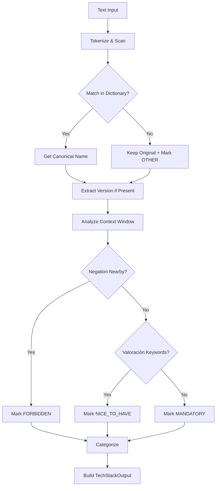

# Tech Stack Mapper Skill

## Propósito

Esta habilidad es el **analizador de stack tecnológico** de TenderCortex. Extrae entidades tecnológicas de RFPs, las normaliza a nombres canónicos y las categoriza para evaluar compatibilidad con las capacidades de la empresa.

**Capacidades principales:**

| Función | Descripción |
|---------|-------------|
| **Normalización** | "ReactJS", "React.js", "React" → `React` |
| **Categorización** | Lenguajes, Frameworks, DBs, Infra, Seguridad |
| **Requirement Level** | MANDATORY vs NICE_TO_HAVE vs FORBIDDEN |
| **Version Detection** | "Python >=3.8", "Java 17" → constraints |

## Directrices de Uso Operativo

### Cuándo Usar
- Analizar requisitos técnicos de un pliego
- Evaluar compatibilidad con stack de la empresa
- Detectar vendor lock-in o restricciones
- Identificar tecnologías prohibidas

### Cuándo NO Usar
- Requisitos legales o financieros
- Fechas y cronogramas (usar GanttTimelineExtractor)

### Entrada

| Parámetro | Tipo | Requerido | Descripción |
|-----------|------|-----------|-------------|
| `text_chunks` | `List[str]` | ✅ | Fragmentos de texto del pliego |
| `company_stack` | `List[str]` | ❌ | Stack de la empresa para match |
| `include_context` | `bool` | ❌ | Incluir snippets de contexto |

### Salida

`TechStackOutput`:
- `entities`: Lista de `TechEntity` detectadas
- `stack_summary`: Resumen en lenguaje natural
- `mandatory_stack`: Solo tecnologías obligatorias
- `forbidden_stack`: Tecnologías prohibidas
- `compatibility_score`: (si se provee company_stack)

## Taxonomía de Categorías

| Categoría | Ejemplos | Keywords |
|-----------|----------|----------|
| `LANGUAGE` | Python, Java, Go, TypeScript | lenguaje, programación |
| `FRAMEWORK` | React, Spring, Django, FastAPI | framework, librería |
| `DATABASE` | PostgreSQL, MongoDB, Redis | base de datos, BBDD |
| `INFRASTRUCTURE` | AWS, Azure, Docker, K8s | cloud, infraestructura |
| `SECURITY_CERT` | ISO 27001, SOC2, ENS | certificación, seguridad |
| `OTHER` | Git, JIRA, Agile | herramienta, metodología |

## Diccionario de Normalización

El mapper incluye 200+ mappings de variaciones comunes:

```python
CANONICAL_MAP = {
    # JavaScript ecosystem
    "reactjs": "React",
    "react.js": "React",
    "react js": "React",
    "vuejs": "Vue.js",
    "vue": "Vue.js",
    "angular": "Angular",
    "angularjs": "AngularJS",  # Diferente!
    
    # Python ecosystem
    "python3": "Python",
    "python 3": "Python",
    "py": "Python",
    "django": "Django",
    "fastapi": "FastAPI",
    "flask": "Flask",
    
    # Java ecosystem
    "java": "Java",
    "openjdk": "Java",
    "spring": "Spring Framework",
    "springboot": "Spring Boot",
    "spring boot": "Spring Boot",
    
    # Databases
    "postgres": "PostgreSQL",
    "postgresql": "PostgreSQL",
    "pgsql": "PostgreSQL",
    "mysql": "MySQL",
    "mariadb": "MariaDB",
    "mongo": "MongoDB",
    "mongodb": "MongoDB",
    
    # Cloud
    "aws": "AWS",
    "amazon web services": "AWS",
    "azure": "Microsoft Azure",
    "gcp": "Google Cloud Platform",
    "google cloud": "Google Cloud Platform",
}
```

## Detección de Requirement Level

El mapper analiza el contexto para determinar si la tecnología es:

### MANDATORY
```
Indicadores: "debe", "deberá", "obligatorio", "requerido", 
             "imprescindible", "must", "required", "shall"
             
Ejemplo: "La solución DEBE estar desarrollada en Java"
         → Java (MANDATORY)
```

### NICE_TO_HAVE
```
Indicadores: "se valorará", "deseable", "preferible", "bonus",
             "puntuará", "opcional", "preferred", "plus"
             
Ejemplo: "Se valorará experiencia en Kubernetes"
         → Kubernetes (NICE_TO_HAVE)
```

### FORBIDDEN
```
Indicadores: "no", "nunca", "prohibido", "migrar desde", 
             "reemplazar", "legacy", "evitar", "must not"
             
Ejemplo: "No aceptamos soluciones en PHP"
         → PHP (FORBIDDEN)
         
Ejemplo: "Migrar desde Oracle a PostgreSQL"
         → Oracle (FORBIDDEN), PostgreSQL (MANDATORY)
```

## Ejemplos de Invocación (Few-Shot)

### Ejemplo 1: Stack completo con forbidden
```python
text = """
Buscamos migrar un monolito Java 8 a microservicios en Go,
desplegados en Azure. No usar Oracle. Se valorará experiencia
con Kubernetes y Docker.
"""

mapper = TechStackMapper()
result = mapper.extract([text])

# Output:
{
    "entities": [
        {
            "raw_text": "Java 8",
            "canonical_name": "Java",
            "category": "LANGUAGE",
            "version_constraint": "8",
            "requirement_level": "FORBIDDEN",  # "migrar desde"
            "context_snippet": "migrar un monolito Java 8"
        },
        {
            "raw_text": "Go",
            "canonical_name": "Go",
            "category": "LANGUAGE",
            "requirement_level": "MANDATORY",
            "context_snippet": "microservicios en Go"
        },
        {
            "raw_text": "Azure",
            "canonical_name": "Microsoft Azure",
            "category": "INFRASTRUCTURE",
            "requirement_level": "MANDATORY"
        },
        {
            "raw_text": "Oracle",
            "canonical_name": "Oracle Database",
            "category": "DATABASE",
            "requirement_level": "FORBIDDEN"
        },
        {
            "raw_text": "Kubernetes",
            "canonical_name": "Kubernetes",
            "category": "INFRASTRUCTURE",
            "requirement_level": "NICE_TO_HAVE"
        }
    ],
    "stack_summary": "Stack requerido: Go + Azure. Legacy: Java 8. Prohibido: Oracle."
}
```

### Ejemplo 2: Detección de versiones
```
Texto: "Backend en Python 3.10+, frontend en React 18"

Output:
  - Python (LANGUAGE, version: ">=3.10")
  - React (FRAMEWORK, version: "18")
```

### Ejemplo 3: Evaluación de compatibilidad
```python
result = mapper.extract(
    [rfp_text],
    company_stack=["Python", "Django", "PostgreSQL", "AWS"]
)

# Output adicional:
{
    "compatibility": {
        "matched": ["Python", "AWS"],
        "missing": ["Kubernetes"],
        "conflicts": [],
        "score": 0.75
    }
}
```

## Guardrails y Limitaciones

> [!CAUTION]
> **Ambigüedad de "Go"**: El lenguaje Go puede confundirse con el verbo inglés. El mapper usa análisis de contexto ("en Go", "con Golang") para validar.

> [!WARNING]
> **Versiones implícitas**: Si el texto dice "Java moderno" sin versión específica, se asume la última LTS pero se marca con baja confianza.

> [!NOTE]
> **Tecnologías nuevas**: El diccionario se actualiza periódicamente pero puede no incluir tecnologías muy recientes. Se detectarán como `OTHER` con el nombre original.

## Diagrama de Flujo


